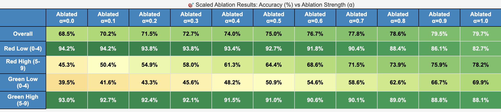

# Faithful-SAE: Parameter Decomposition for Zero-Overhead Debiasing

An exploration into using Sparse Autoencoders for direct parameter decomposition, enabling efficient model debiasing without computational overhead during inference.

## 🚀 Overview

This project introduces **Faithful-SAE**, a novel approach that combines ideas from:
- **Attribution-based Parameter Decomposition (APD)** - decomposing model parameters to understand feature contributions
- **SCAR: Sparse Conditioned Autoencoders** - using SAEs for concept detection and steering in language models

### Key Innovation

Instead of learning to reconstruct activation spaces like traditional SAEs, **Faithful-SAE reconstructs weight matrices directly**. We reformulate the APD problem by:

1. **Training an SAE** to reconstruct pre-ReLU activations of layer `n+1` given post-ReLU activations of layer `n`
2. **Adding a faithfulness constraint** that the outer product of encoder/decoder matrices must approximate the original weight matrix (via MSE loss)
3. **Decomposing into rank-1 components** rather than using traditional sparsity penalties

This creates interpretable, ablatable components that can be selectively removed for debiasing without any inference overhead.

## 🎯 Results

### Toy Model Validation

Successfully demonstrated parameter decomposition on the 5-2 superposition toy model, decomposing the weight matrix into 5 distinct components with excellent reconstruction fidelity.

<div align="center">
  
  
</div>

### Colorized-MNIST Debiasing

Tested on spurious correlation removal in colorized-MNIST, where models learn to associate:
- Digits 0-4 with red backgrounds  
- Digits 5-9 with green backgrounds

**Results:**
- **+34.3% worst-group accuracy improvement** when ablating bias components
- Systematic debiasing across all demographic groups
- Zero computational overhead during inference

**Worst Group Performance (Fairness Metric):**


**Detailed Results Across All Groups:**


## 🛠️ Getting Started

### Prerequisites
```bash
git clone https://github.com/jayaneetha/colorized-MNIST.git
```

### Running Experiments

**Color Debiasing:**
```bash
cd color_debiasing
python run.py                    # Basic training
python optuna_run.py             # Hyperparameter optimization
```

**Toy Model Experiments:**
```bash
cd faithful_sae_best
python train_faithful_sae.py     # Train on 5-2 superposition model
```

## 📊 Key Features

- **Zero Inference Overhead** - Debiasing via permanent weight modification
- **Interpretable Components** - Each SAE feature corresponds to a rank-1 weight component  
- **Scalable Approach** - Can be applied to any feedforward layer
- **Conditioning Support** - Train components to detect specific concepts (colors, demographics, etc.)

## 🔬 Technical Details

The core insight is reformulating parameter decomposition as a reconstruction problem:

```
W_original ≈ Σᵢ (encoder[:, i] ⊗ decoder[i, :])
```

Where each component represents a specific feature or bias that can be ablated by setting its corresponding SAE feature to zero.

## 🚧 Ongoing Investigation

This is an active research project exploring the intersection of mechanistic interpretability and practical debiasing. Current directions include:

- Scaling to larger models and datasets
- Multi-layer decomposition strategies  
- Integration with other interpretability methods
- Theoretical analysis of decomposition quality

## 📁 Repository Structure

```
Faithful_SAE/
├── color_debiasing/           # Colorized-MNIST experiments
│   └── training_run_artifacts/    # Experimental results
└── faithful_sae_best/         # Toy model validation
    └── figures/               # Visualization outputs
```

---

*This work demonstrates a promising direction for efficient, interpretable model debiasing through direct parameter manipulation.*